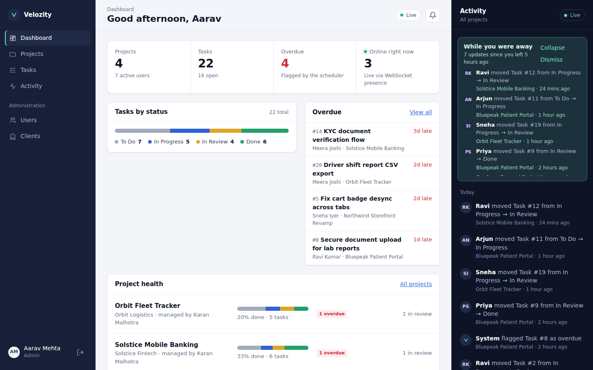
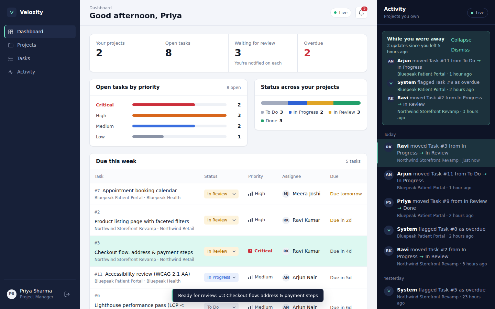
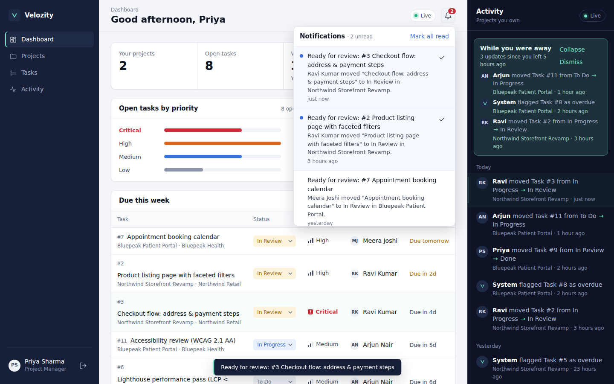
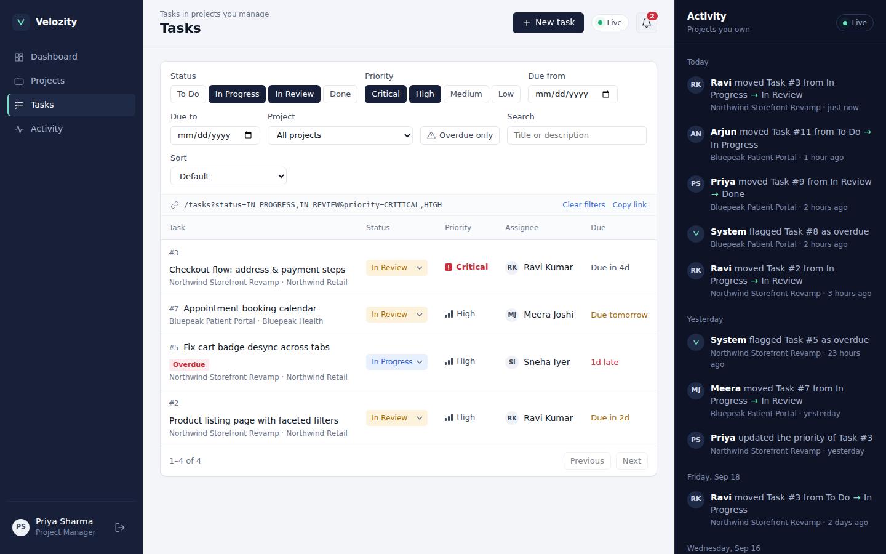
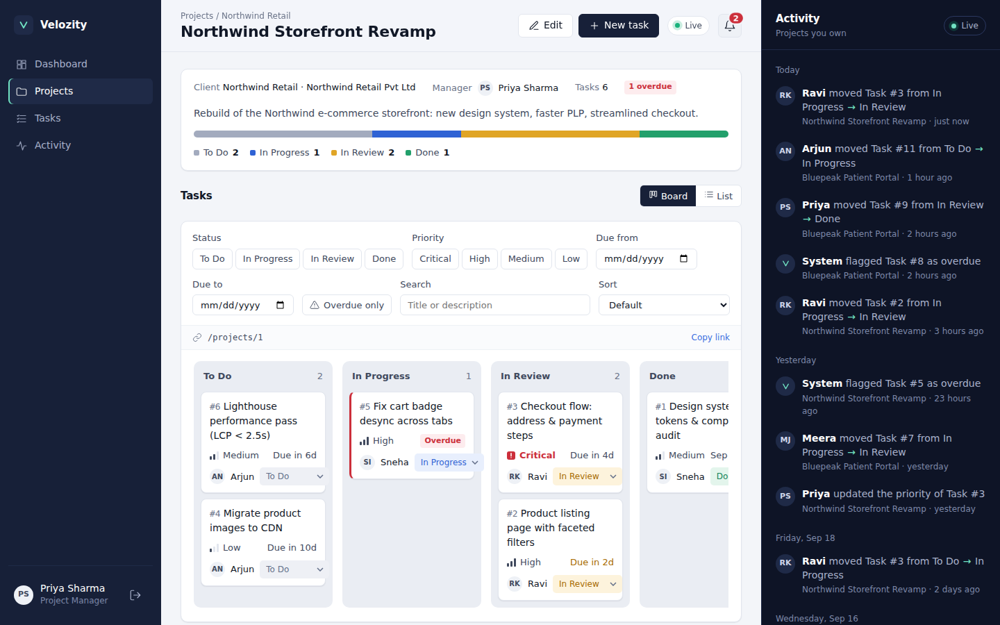
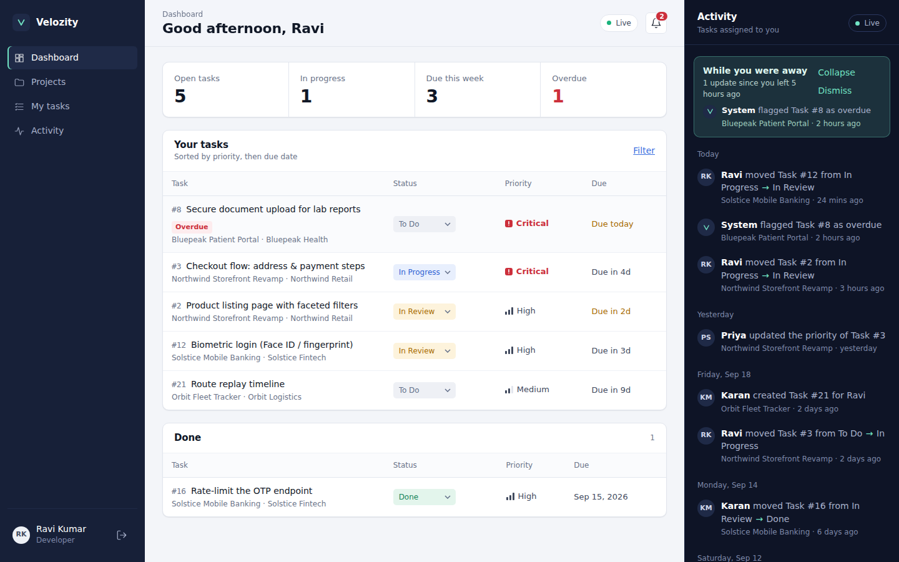
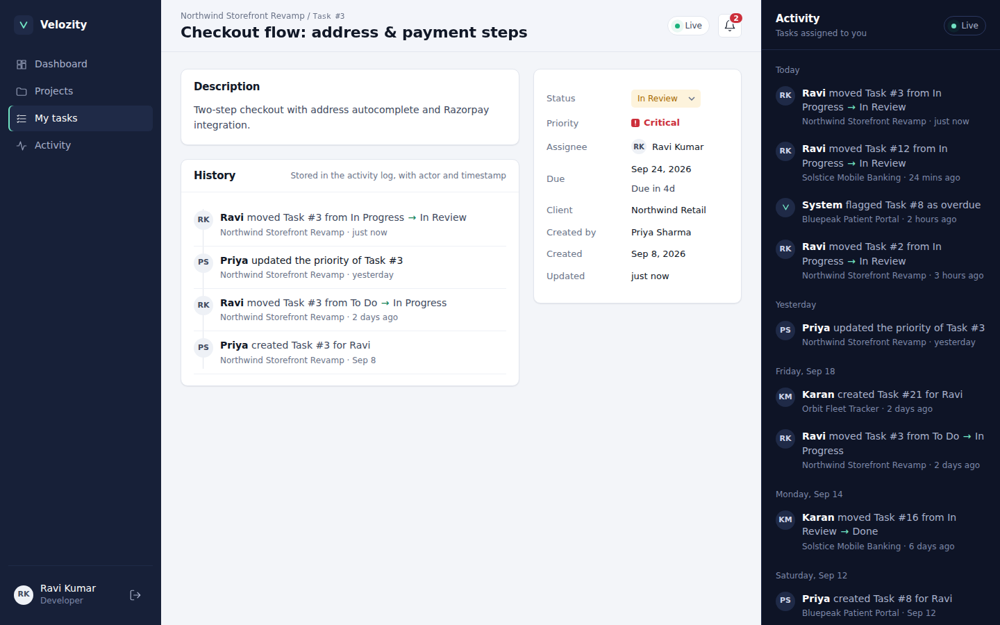
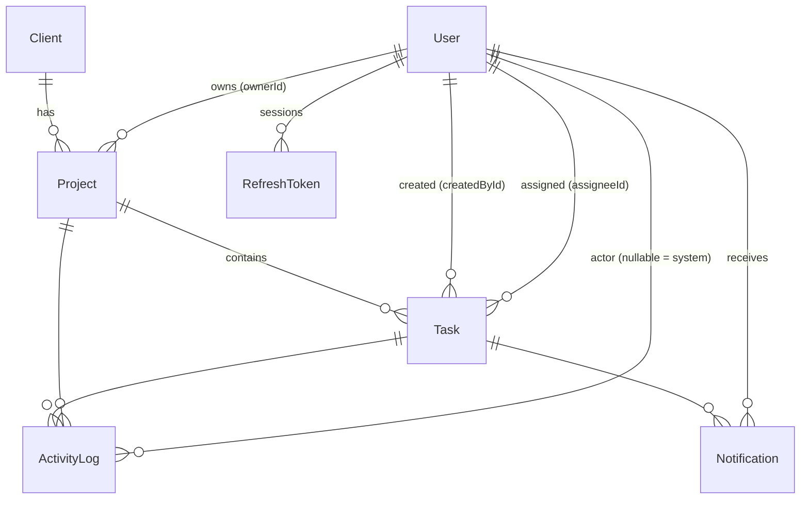

# Velozity — Real-Time Client Project Dashboard

A full-stack project dashboard for an agency: admins, project managers and developers see **only what their role allows**, and every change shows up **live** over WebSockets — including a catch-up digest of what you missed while you were away.

**Live demo:** `https://<your-app>.vercel.app` · **API:** `https://<your-api>.onrender.com/api/health`

> Free-tier hosting sleeps after 15 minutes idle. If the first load hangs, give the API ~40 seconds to wake up.



<table>
<tr>
<td><br/><sub><b>Live:</b> Ravi moves Task #3; Priya's feed, badge and row update without a refresh</sub></td>
<td><br/><sub>DB-stored notifications; the unread count is pushed over the WebSocket</sub></td>
</tr>
<tr>
<td><br/><sub>Every filter lives in the URL, so a filtered view is a shareable link</sub></td>
<td><br/><sub>Project board; overdue tasks are flagged by the scheduled job</sub></td>
</tr>
<tr>
<td><br/><sub>Developer view: only their tasks, sorted by priority then due date</sub></td>
<td><br/><sub>Task history read from the activity log (actor + timestamp)</sub></td>
</tr>
</table>

### Demo accounts — password `Password@123` for all

| Role | Email | What to try |
|---|---|---|
| Admin | `admin@velozity.dev` | Global feed, live "online right now" counter, Users & Clients admin |
| Project Manager | `priya@velozity.dev` | Owns *Northwind* + *Bluepeak* only. Gets notified when a task moves to In Review |
| Project Manager | `karan@velozity.dev` | Owns *Solstice* + *Orbit* only |
| Developer | `ravi@velozity.dev` | Sees only his assigned tasks; can change their status |
| Developer | `sneha@`, `arjun@`, `meera@velozity.dev` | Same, different tasks |

**The 60-second tour:** open two browser windows (one normal, one private). Sign in as **Priya** in one and **Ravi** in the other. As Ravi, open *Task #3* and move it to *In Review*. Priya's feed shows `Ravi moved Task #3 from In Progress → In Review · just now` and her bell count goes up — with no refresh. Sign in as **Karan** in a third window: he sees nothing, because he doesn't own that project.

---

## Contents
0. [Requirement checklist](#requirement-checklist)
1. [Run it locally](#1-run-it-locally)
2. [Architecture](#2-architecture)
3. [Access control](#3-access-control)
4. [Real-time feed and catch-up](#4-real-time-feed-and-catch-up)
5. [Database schema and indexes](#5-database-schema-and-indexes)
6. [Architectural decisions](#6-architectural-decisions)
7. [Testing](#7-testing)
8. [Deployment](#8-deployment)
9. [Known limitations](#9-known-limitations)
10. [API reference](#10-api-reference)

---

## Requirement checklist

Where each point of the brief is implemented, with the test that proves it.

| Brief requirement | Where | Proof |
|---|---|---|
| Role middleware on **every** protected route; enforced at API level | `middleware/auth.ts` (`authenticate` re-reads the role from the DB) + `requireRole` on each router + row scopes in `policies/access.ts` | `rbac.test.ts` |
| Developer can't reach a PM's data even with a modified token | HS256 pinned, role taken from DB not token, out-of-scope rows → 404 | `rbac.test.ts` (forged role, `alg:none`) |
| JWT access + refresh; refresh in HttpOnly cookie, not localStorage | Access token in memory only; `vz_rt` cookie `HttpOnly; Path=/api/auth`; rotation + reuse detection | `auth.test.ts` |
| Status changes stored with timestamp + actor (not derived) | `ActivityLog(actorId, fromStatus, toStatus, createdAt)` written in the same transaction | `rbac.test.ts` |
| PM only manages projects they created | `projectScope` / `canManageProject` on `Project.ownerId` | `rbac.test.ts` |
| Overdue flagging is a scheduled background job | `jobs/overdue.job.ts` (node-cron, advisory lock, idempotent) | `overdue.test.ts` |
| Live feed over WebSockets, no long-polling | Socket.io with `transports: ['websocket']` on server **and** client | `realtime.test.ts` |
| Feed filtered by role (Admin all / PM own projects / Dev own tasks) | Server-side recipients `activityAudience()`; no client→server events | `realtime.test.ts` |
| Offline users get last 20 missed events **from the DB** | `activityService.missedSince` (Postgres query, `LIMIT 20`) sent on connect | `realtime.test.ts` |
| Admin live online-user count via WebSocket presence | `realtime/presence.ts` → `presence:update` to admins | `realtime.test.ts` |
| PM: projects summary, tasks by priority, due this week · Dev: sorted by priority then due date | `modules/dashboard` (payload chosen by DB role) | manual + UI |
| Filters (status, priority, due range) as URL query params | `/tasks?status=…&priority=…&dueFrom=…&dueTo=…` — the page URL is passed to the API unchanged | `rbac.test.ts` (filters) |
| DB-stored notifications; PM notified on *In Review*; unread count via WebSocket | `Notification` table; `notification:count` pushed on every change | `realtime.test.ts` |
| Server-side validation, structured errors, no stack traces | Zod `.strict()` schemas; `{ error: { code, message, details?, requestId } }` | `rbac.test.ts` |
| Secrets in `.env` only | Validated at boot; Docker secrets generated by `scripts/setup-env.sh` | — |
| Seed: 1 admin, 2 PMs, 4 devs, 3+ projects × 5+ tasks, 2+ overdue, activity | `server/prisma/seed.ts` → 7 users, 4 projects, 22 tasks, 4 overdue, 63 events | test global setup |

---

## 1. Run it locally

### Option A — Docker (recommended)

Needs Docker and Docker Compose. Nothing else.

```bash
git clone https://github.com/<you>/velozity-dashboard.git
cd velozity-dashboard
./scripts/setup-env.sh      # writes .env with freshly generated secrets (none are committed)
docker compose up --build
```

Open **http://localhost:8080**. On first boot the API container runs `prisma migrate deploy`, seeds the database (only if it's empty), and starts. nginx serves the app and proxies `/api` and `/socket.io` to the API, so the browser only talks to one origin.

To reset the demo data: `docker compose down -v && docker compose up --build`.

### Option B — Without Docker

Needs Node 20+ and PostgreSQL 14+.

```bash
# API
cd server
cp .env.example .env            # set DATABASE_URL and two different JWT secrets
npm install
npx prisma migrate deploy
npm run db:seed
npm run dev                     # http://localhost:4000

# Web (new terminal)
cd client
npm install
npm run dev                     # http://localhost:5173
```

Vite proxies `/api` and `/socket.io` to port 4000, so dev behaves the same as production.

### What the seed script creates

`server/prisma/seed.ts` is deterministic, so task ids are stable and the demo steps above always match.

- **7 users:** 1 Admin, 2 Project Managers, 4 Developers.
- **4 clients and 4 projects**, 5–6 tasks each (22 tasks in total).
- **4 overdue tasks**, flagged by the same code the scheduler runs.
- **63 activity entries and 36 notifications.**

The activity log isn't random. The seed **replays each task's real status history** (To Do → In Progress → In Review → Done) with timestamps that fit, so the log always agrees with the tasks' current state. Every user's `lastSeenAt` is set to 5 hours ago, so the "While you were away" catch-up has real content the first time you sign in.

---

## 2. Architecture

```
┌──────────── Browser (React + TS) ─────────────┐
│ React Query cache ◄── SocketProvider (1 WS)   │
│ access token: memory only                     │
│ refresh token: HttpOnly cookie (path /api/auth)│
└───────┬──────────────────────────┬────────────┘
        │ HTTPS /api/*             │ WSS /socket.io (websocket transport only)
┌───────▼──────────────────────────▼────────────┐
│ Express 5 + Socket.io 4                       │
│  routes → controller → service → Prisma       │
│            │                                   │
│   policies/access.ts ← one source of truth for │
│   "who may see what" (REST scopes + WS rooms)  │
│  node-cron overdue sweep (pg advisory lock)    │
└───────────────────────┬───────────────────────┘
                        │
                  PostgreSQL 16
```

```
server/src
├── config/env.ts          zod-validated env; the process refuses to boot on bad config
├── middleware/            requestId, authenticate + requireRole, uniform error handler
├── policies/access.ts     ★ row-level scopes and real-time audiences, per role
├── modules/<feature>/     routes → controller → service (+ zod schemas)
│   auth · users · clients · projects · tasks · activity · notifications · dashboard
├── realtime/              typed events, socket auth, presence, publisher
├── jobs/overdue.job.ts    scheduled overdue sweep
└── lib/                   prisma client, JWT, AppError, logger
```

Controllers only parse input and shape the HTTP response. Services own the business rules and transactions. **No SQL lives in controllers.** Every query goes through Prisma in the service layer. The only raw SQL is the advisory lock call inside the job.

---

## 3. Access control

Access is enforced **on the server, at two layers, on every protected route**. The frontend hides screens a role can't use, but only as a convenience. It never grants anything.

**Layer 1 — Role gate.** `requireRole('ADMIN', 'PROJECT_MANAGER')` protects routes that some roles can never call. Example: developers can't create tasks.

**Layer 2 — Row scope.** `policies/access.ts` turns the current user into a Prisma `where` clause that every read and write is filtered through:

| Role | Projects | Tasks | Activity |
|---|---|---|---|
| Admin | all | all | all |
| Project Manager | `ownerId = me` | tasks in projects I own | events on projects I own |
| Developer | projects where I have tasks | `assigneeId = me` | events on my tasks |

Some design choices worth calling out:

- **The token's role claim is never trusted.** `authenticate` verifies the JWT and then **reloads the user from the database**, and it uses the database role for every check. A developer who edits their token to say `"role":"ADMIN"` fails the signature check. Even with a valid signature, the database role would still win. A deactivated user loses access on their next request, not when their token expires.
- **The algorithm is pinned to HS256** for both signing and verifying, so `alg: none` tokens are rejected. Tests cover this.
- **Out-of-scope reads return 404, not 403.** A developer can't tell the difference between "task #7 doesn't exist" and "task #7 belongs to someone else", so ids can't be probed.
- **Strict request bodies.** Unknown fields such as `ownerId` or `projectId` smuggled into an update are rejected with `400 VALIDATION_ERROR`.

### Tokens

| | Access token | Refresh token |
|---|---|---|
| Lifetime | 15 minutes | 7 days |
| Stored in | JavaScript memory only (never `localStorage`) | `HttpOnly` cookie `vz_rt`, `SameSite=Lax`, `Secure` in production, `Path=/api/auth` |
| Sent | `Authorization: Bearer` header and the WebSocket handshake | Automatically, only to `/api/auth/*` |

**Refresh tokens rotate on every use.** Each token is a database row (`RefreshToken.id` = the JWT's `jti`), grouped into a *family* per login. If a token that was already rotated is presented again, that means it was stolen and replayed, so the **whole family is revoked** (`REFRESH_REUSED`).

There's one exception: a 10-second grace window lets two tabs refresh with the same cookie at the same moment. It only applies while the family still has a live token, so logout and reuse revocation take effect immediately.

The client makes a single refresh call at a time, even if many requests get a 401 together, and then retries the original requests.

### Errors

Every error has the same shape, and stack traces are never sent to the client:

```json
{ "error": { "code": "VALIDATION_ERROR", "message": "Invalid request", "details": [{ "path": "dueDate", "message": "Invalid date" }], "requestId": "3f2c…" } }
```

---

## 4. Real-time feed and catch-up

### Delivery

1. **The client can't choose what it hears.** The server defines *no* client→server events. On connect, the socket is verified (access token plus a database lookup), then the **server** puts it in `user:<id>` and, for admins, in `admins`. A client can't join someone else's room because no event exists to ask for one.
2. **Each event has an explicit audience.** `activityAudience()` in `policies/access.ts` returns `admins + project owner + assignee`, with duplicates removed. This is the same policy module that scopes the REST reads, so the live feed and the history API can't disagree about who sees what.
3. **Events are published only after the commit.** A status change writes the task update, the `ActivityLog` row and any notifications in **one transaction**. The socket event goes out only after that commits, so nobody sees an event that was rolled back.
4. **Concurrent edits are detected.** Status changes send `expectedStatus`, and the update's `WHERE` clause includes it. If someone else moved the task first, the request fails with `409 CONFLICT` instead of silently overwriting their change.

The feed line is built on the client from structured data (`actor`, `fromStatus`, `toStatus`, `taskId`). Stored text would go stale if a task were renamed:

> **Ravi** moved Task #12 from In Progress → In Review · 2 mins ago

### Catch-up for offline users

Presence is reference-counted per user, so three tabs count as one person. When a user's **last** socket closes, the server writes `User.lastSeenAt`.

On the next connection, the server first works out where the catch-up window starts:

- If the user **already has another socket open**, they were never away, so the digest is empty. Opening a second tab doesn't replay anything.
- Otherwise the window starts at the later of `User.lastSeenAt` and an in-memory "went offline at" timestamp that is recorded synchronously at disconnect. Without the in-memory value, a fast page reload could open the new socket before the async `lastSeenAt` write finished, and replay events the user had just watched arrive live. This race is covered by a regression test.

Then the server runs **a Postgres query, not a memory lookup**: in-scope `ActivityLog` rows newer than `lastSeenAt`, excluding the user's own actions (system events are kept), newest first, `LIMIT 20`. It emits the result as `activity:missed`, along with the total count. The UI shows it as a collapsible *While you were away* digest.

Because this is a database read, it still works after an API restart or a deploy, when all in-memory state is gone.

After that, the feed page loads older history with **keyset pagination**: the cursor is `(createdAt, id)`, not `OFFSET`, so pages don't shift while new events are being added at the top.

### Cache freshness without polling

Nothing in the UI polls. React Query has `refetchOnWindowFocus: false`. Socket events either insert the new item straight into the cached feed or invalidate exactly the queries they affect (tasks, dashboard, project). Unread notification counts arrive as `notification:count`, and the admin's online count arrives as `presence:update`.

**Why WebSocket-only:** Socket.io normally starts with HTTP long-polling and then upgrades. The brief rules out long-polling, so both the server and the client set `transports: ['websocket']`. You can check this in the browser's network tab: every `/socket.io` request is `transport=websocket` with a `101 Switching Protocols` response.

---

## 5. Database schema and indexes



| Table | Purpose and notable columns |
|---|---|
| `User` | `role` enum, `isActive`, `lastSeenAt` (drives catch-up) |
| `RefreshToken` | `id` = JWT `jti`, `familyId` for rotation chains, `revokedAt` |
| `Client` | Organisation that projects are delivered for |
| `Project` | `clientId`, **`ownerId`** (the PM; defines PM scope) |
| `Task` | `status`, `priority`, `dueDate`, `assigneeId`, **`isOverdue` / `overdueSince` (written only by the scheduler)** |
| `ActivityLog` | **Append-only.** `actorId` (null = system), `fromStatus`, `toStatus`, `createdAt`, `meta` JSON. Status history is stored here as it happens, not reconstructed later. |
| `Notification` | `userId`, `type`, `readAt` (null = unread) |

**Foreign-key behaviour is chosen per relation.** Deleting a project cascades to its tasks and activity. Deleting a user nulls `assigneeId` (the task stays and becomes unassigned) and `actorId` (the history stays). A client or project owner can't be deleted while they still own projects (`Restrict`).

**Priority is an ordered enum.** It's declared `LOW → CRITICAL`, and Postgres sorts enums by declaration order, so `ORDER BY priority DESC, dueDate ASC` gives the developer's "priority, then due date" list directly from the index. No `CASE` expression is needed.

### Indexes — each one exists for a specific query

| Index | Query it serves |
|---|---|
| `Task(assigneeId, status)` | Developer task list and dashboard: *my tasks, optionally filtered by status*. This is the most frequent read. |
| `Task(projectId, status)` | Project board columns, per-project stats (`GROUP BY projectId, status`), and PM scope joins |
| `Task(status, dueDate)` | The overdue sweep (`status <> DONE AND dueDate < now()`) and "due this week" |
| `Task(isOverdue)` | Overdue counters and lists on dashboards |
| `ActivityLog(createdAt DESC)` | Admin global feed and keyset pagination |
| `ActivityLog(projectId, createdAt DESC)` | PM feed and per-project feed: an index range scan instead of scan-then-sort |
| `ActivityLog(taskId, createdAt DESC)` | Task timeline and the developer's feed |
| `Notification(userId, readAt)` | Unread badge count (`readAt IS NULL`), which runs after every change |
| `Notification(userId, createdAt DESC)` | Notification dropdown |
| `Project(ownerId)` | Every PM-scoped query |
| `Project(clientId)` | Client → projects lookups and the delete guard |
| `RefreshToken(familyId)` / `(userId)` | Revoke a whole family on reuse, and revoke all of a user's sessions on role change |
| `User(role)` | Admin user list filters and the assignable-developers picker |
| `User(email)` unique | Login |

A few things were deliberately **not** indexed. There are no single-column indexes on `Task.status` or `Task.priority`: both are low-cardinality and already covered by the composite indexes. There is no index on `ActivityLog.actorId`, because no query filters by actor alone.

---

## 6. Architectural decisions

**Express 5 over Fastify.** The bottleneck in this app is database and WebSocket I/O, not HTTP routing, so Fastify's throughput advantage wouldn't show up. Express 5 forwards rejected promises from async handlers to the error middleware natively, which removes the main reason people used to switch. Socket.io attaches to Express's `http.Server` without an adapter. Validation is handled by zod on both sides of the stack, so Fastify's JSON-schema pipeline wasn't needed.

**Socket.io over the native `ws` library.** Four things it gives us that would otherwise need to be written by hand:
- **Rooms**, which the role-filtered fan-out is built on.
- **An auth hook in the handshake**, so a socket is rejected before it's fully connected.
- **Automatic reconnection with backoff.** The auth payload is re-read on every attempt, so a refreshed token is used.
- **Typed event maps** shared between server and client.

With `ws` all four would be custom code. The main argument against Socket.io is the long-polling fallback, and that is turned off here.

**node-cron over Bull.** The overdue sweep is one idempotent `UPDATE … WHERE dueDate < now() AND status <> 'DONE' AND isOverdue = false`, run every minute. It has no payload, no retries and no fan-out, which is what Bull's Redis queue is for. Adding Redis just to run a timer would add infrastructure without adding value.

Running on multiple instances is still handled. The sweep takes `pg_try_advisory_xact_lock` inside its transaction, so if several API instances run the job, only one sweeps each tick and the others skip. It's also idempotent, so a skipped or duplicate tick is harmless. **If** jobs grew to include emails or retries, moving to BullMQ would be the right step.

Overdue status is **never computed when a page loads**. The job writes `isOverdue`, logs a `TASK_OVERDUE` activity entry (with no actor, meaning "System"), and notifies the assignee. Every read just uses the stored flag. Completing or rescheduling a task clears it.

**Prisma 6 over raw SQL.** It gives typed queries, migrations under version control, and `$transaction` for the task + activity + notification writes. It runs in `engineType = "client"` mode with the `pg` driver adapter, which removes the Rust query-engine binary. That makes the Docker image smaller and avoids platform-specific binary downloads during deploys.

**Why the access token lives in memory.** Anything in `localStorage` can be read by any script that gets onto the page (XSS). An in-memory token disappears on reload, so on page load the app calls `/auth/refresh`, and the HttpOnly cookie restores the session. The cookie's `Path=/api/auth` means it's never even sent to the rest of the API. `SameSite=Lax` plus a JSON-only API gives CSRF protection without a separate CSRF token.

**Filters in the URL.** The task list's filters, such as `?status=IN_PROGRESS,IN_REVIEW&priority=CRITICAL&dueFrom=2026-09-01`, are the React Query key and are also sent to the API unchanged. A copied link reproduces exactly the same view for anyone who has the same access. If you open a shared link while signed out, you'll be returned to it after signing in.

---

## 7. Testing

```bash
cd server && npm test      # 37 integration tests against a real PostgreSQL database
```

The tests use no mocks: a real Express server on an ephemeral port, real Socket.io clients and a freshly seeded database. They cover:

- **RBAC:** a forged role claim is rejected; an `alg:none` token is rejected; a developer gets 403 on admin and PM routes and 404 on another developer's task and its history; a PM gets 404 on another PM's project; smuggled body fields are rejected; a status change writes an `ActivityLog` row with actor, from, to and timestamp; a stale write returns 409.
- **Auth:** the cookie has the right flags and the token never appears in the response body; rotation works; reuse revokes the whole family; two tabs refreshing at once both succeed; logout takes effect immediately; a wrong password and an unknown email return identical errors.
- **Real-time:** a socket with a bad token is rejected; a PM's catch-up contains only their own projects and at most 20 events; a status change reaches the admin, the owning PM and the assignee **and nobody else**; the unread count is pushed; admins receive presence updates; a second tab and a fast page reload do **not** replay missed events.
- **Overdue job:** it flags, logs and notifies **exactly once** (idempotent), and it never flags or leaves flagged a task that's Done.

CI (`.github/workflows/ci.yml`) runs typecheck, migrations and the test suite against a Postgres service container, and builds the client.

---

## 8. Deployment

Vercel runs serverless functions. A serverless function can't keep a WebSocket open or run a cron loop, so the stack is split in two:

| Part | Host | Why |
|---|---|---|
| React SPA | **Vercel** | Static hosting and CDN. `vercel.json` rewrites `/api/*` to the API. |
| API + Socket.io + cron | **Render** (web service) | A long-running Node process with WebSocket support |
| PostgreSQL | **Render** (or Neon) | Managed Postgres |

1. **API:** Render → *New → Blueprint* → select this repo. `render.yaml` creates the database and the web service, and generates both JWT secrets. After it's created, set `CLIENT_ORIGIN` to your Vercel URL. On first boot the service migrates and seeds.
2. **Frontend:** in `client/vercel.json`, replace `YOUR-API.onrender.com` with your Render host. Then Vercel → *New Project* → root directory `client`, framework Vite. Set the env var `VITE_SOCKET_URL=https://<your-api>.onrender.com`.

REST calls go through Vercel's `/api` rewrite, so the refresh cookie is first-party to the Vercel domain and `SameSite=Lax` works. Vercel rewrites don't carry WebSockets, so the socket connects straight to Render. That connection authenticates with the access token in the handshake, not the cookie, so crossing origins is fine; `CLIENT_ORIGIN` allow-lists it. `TRUST_PROXY_HOPS=2` accounts for the Vercel and Render proxies, so rate limiting sees the real client IP.

---

## 9. Known limitations

- **Presence and socket fan-out run on a single instance.** Presence counts live in process memory, and Socket.io rooms are local to one process. Scaling horizontally would need `@socket.io/redis-adapter` and a Redis-backed presence set. Nothing else would change: catch-up already reads from Postgres, and the cron job is already safe across instances via the advisory lock.
- **A network blip while another tab stays open.** If one tab's socket drops and reconnects while another tab stays connected, events from that gap aren't added to its digest. That's because `lastSeenAt` is only written when a user's *last* socket closes. The tab refetches its views on reconnect, so the data it shows is correct; only the digest misses those events. (With a single tab, the drop does write `lastSeenAt`, so the digest covers the gap.) A full fix would have the client send the last event id it received and the server replay from there.
- **Free-tier cold starts.** Render's free plan sleeps after 15 minutes idle, and the overdue cron sleeps with it. The job runs once on boot, so it catches up immediately when the service wakes.
- **Not included:** email delivery, file attachments, comments, password reset, and full-text search.
- **Accessibility** has been considered (keyboard focus rings, `aria-live` on the feed, reduced-motion support) but hasn't been audited with a screen reader.

---

## 10. API reference

All routes are under `/api` and require `Authorization: Bearer <access>` unless marked public.

| Method | Path | Roles | Notes |
|---|---|---|---|
| POST | `/auth/login` | public | Rate-limited to 20 per 15 minutes. Sets the refresh cookie. |
| POST | `/auth/refresh` | cookie | Rotates the refresh token |
| POST | `/auth/logout` | cookie | Revokes the token family |
| GET | `/auth/me` | any | |
| GET | `/dashboard` | any | Response shape depends on role |
| GET | `/projects`, `/projects/:id` | any (row-scoped) | Includes per-project stats |
| POST / PATCH / DELETE | `/projects[/:id]` | Admin, PM (own projects) | |
| GET | `/tasks` | any (row-scoped) | `status`, `priority` (comma-separated), `dueFrom`, `dueTo`, `projectId`, `assigneeId`, `overdue`, `sort`, `page`, `pageSize` |
| GET | `/tasks/:id` | any (row-scoped) | |
| PATCH | `/tasks/:id/status` | any (row-scoped) | Body `{ status, expectedStatus }`. Returns 409 on conflict. |
| POST / PATCH / DELETE | `/tasks[/:id]` | Admin, PM (own projects) | |
| GET | `/activity` | any (row-scoped) | Keyset cursor, `projectId`, `taskId` |
| GET | `/activity/missed` | any | The same catch-up the socket sends on connect |
| GET | `/notifications`, `/notifications/unread-count` | any (own) | |
| PATCH | `/notifications/:id/read`, `/notifications/read-all` | any (own) | |
| GET | `/users/assignable` | Admin, PM | |
| GET / POST / PATCH | `/users[/:id]` | Admin | Changing a role or deactivating a user revokes their sessions |
| GET | `/clients` | Admin, PM | |
| POST / PATCH / DELETE | `/clients[/:id]` | Admin | |

**WebSocket events (server → client only):** `activity:new`, `activity:missed`, `notification:new`, `notification:count`, `presence:update` (admins only), `task:revoked`.
